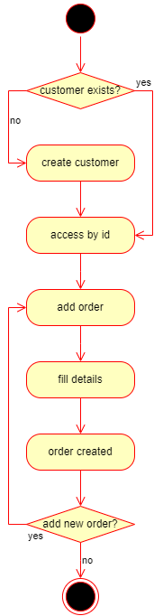

# Furniture Management API

## Overview
A REST API for managing a furniture store with features like stock management, orders, complaints, delivery, supply, and loyalty point system. This API uses a NoSQL database (MongoDB).

---

## Features
- **Customer Management**: Add, retrieve, and manage customer information.
- **Product Inventory**: Manage product stock and details.
- **Order Management**: Place, retrieve, and manage orders.
- **Complaints Handling**: Log and retrieve complaints.
- **Delivery and Supply Tracking**: Manage deliveries and supplies.
- **Loyalty Cards**: Track customer loyalty points.

---

## Documentation
#### Global Use Case Diagram

#### Class Diagram

#### Sequence Diagrams
- **Sequence Diagram 1: Place Order**  
  
- **Sequence Diagram 2: Process Order**  
  
- **Sequence Diagram 3: Manage Delivery**  
  

#### Activity Diagrams
- **Activity Diagram 1: Place Order**  
  
- **Activity Diagram 2: Manage Stock**  
  
- **Activity Diagram 3: Handle Complaint**  
  

---

## API Endpoints
### CRUD Operations
Each resource supports the following CRUD operations:
- **Create**: Add a new resource (HTTP `POST`).
- **Read All**: Retrieve all resources (HTTP `GET` without an `id` parameter).
- **Read One**: Retrieve a specific resource by its unique identifier (HTTP `GET` with an `id` parameter).
- **Update**: Modify an existing resource (HTTP `PUT`).
- **Delete**: Remove an existing resource (HTTP `DELETE`).

### Routes
#### Customer
Below is an example of the routes for the `Customer` schema:
- `POST /customer`: Create a new customer.
- `GET /customer`: Retrieve all customers.
- `GET /customer/:id`: Retrieve a specific customer by its `id`.
- `PUT /customer/:id`: Update an existing customer by its `id`.
- `DELETE /customer/:id`: Delete a specific customer by its `id`.
All of the routes for other schemas are realized in the same way.

### Available Resources
The following resources are available in the application:

1. **Customers**
   - Base Route: `/customers`
2. **Products**
   - Base Route: `/products`
3. **Orders**
   - Base Route: `/orders`
4. **Stocks**
   - Base Route: `/stocks`
5. **Supplies**
   - Base Route: `/supplies`
6. **Complaints**
   - Base Route: `/complaints`
7. **Deliveries**
   - Base Route: `/deliveries`
8. **Delivery Agents**
   - Base Route: `/delivery-agents`
9. **Stock Managers**
   - Base Route: `/stock-managers`
10. **Loyalty Cards**
    - Base Route: `/loyalty-cards`
---

### Prerequisites
- Node.js (v14+)
- MongoDB

### docker
- docker image available for pull:
- `docker pull giorgisvanadze/shop-api:latest`